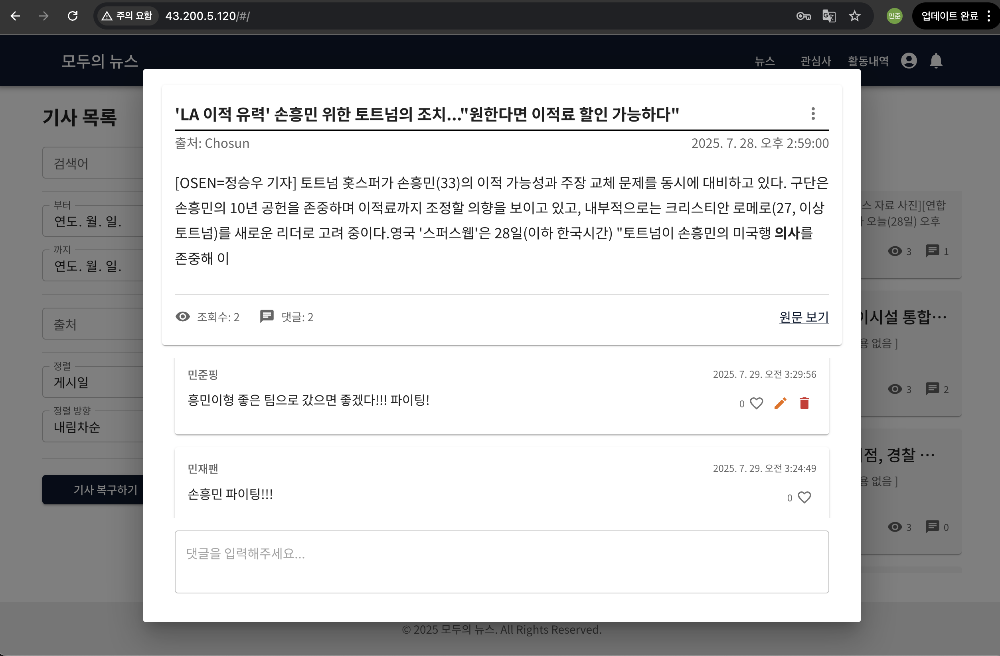
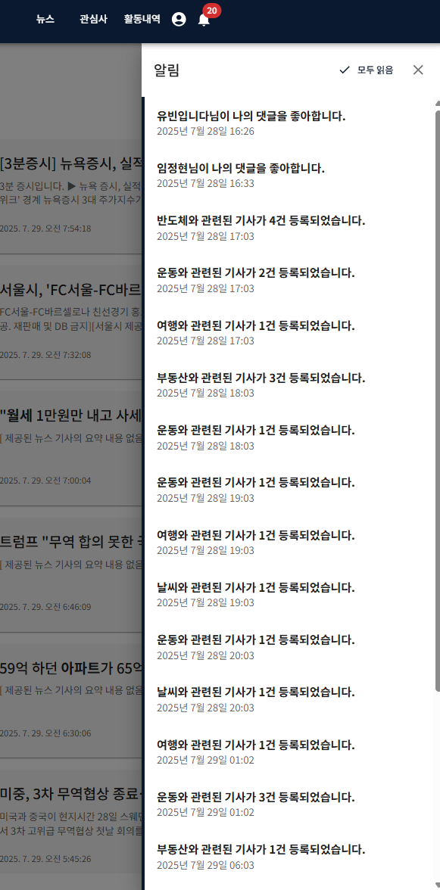
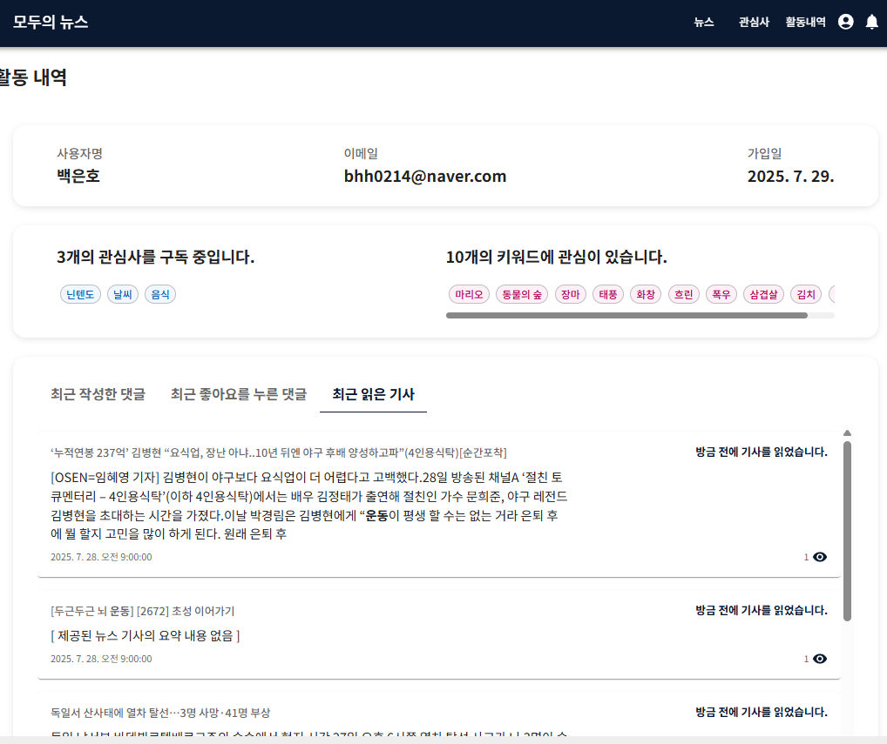
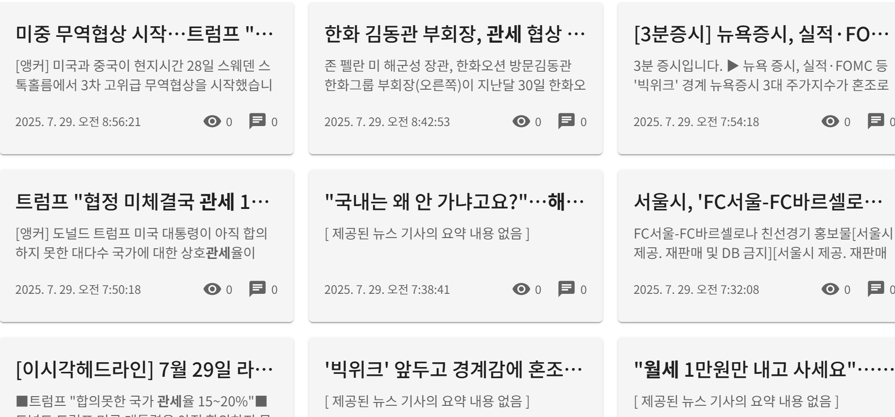
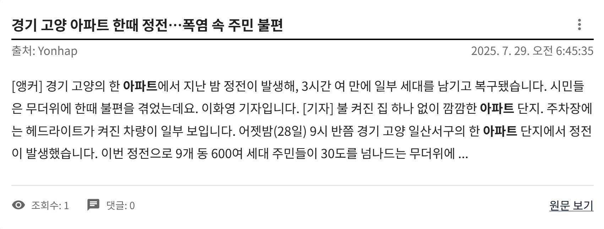
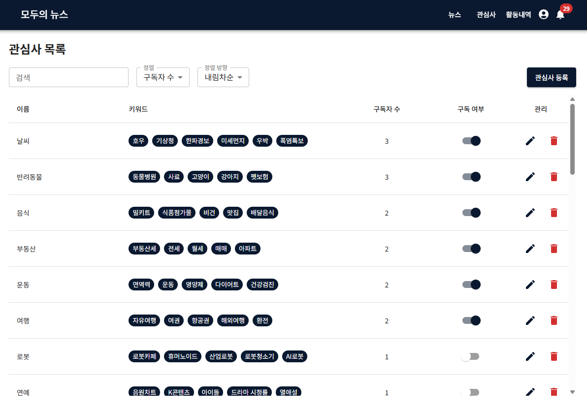
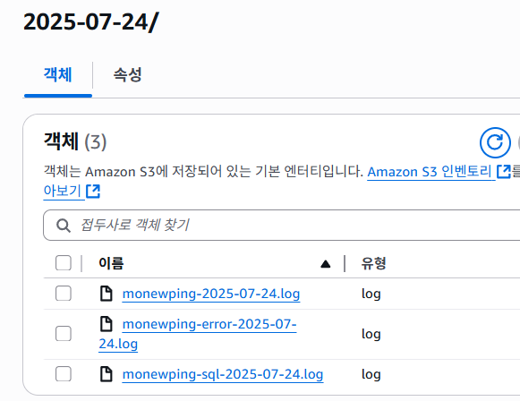

## **{ Heartsping }**

[4랑의 하츄핑](https://www.notion.so/4-207649136c118047b997dcecb838e150?pvs=21)

## **팀원 구성**

김민준 (https://github.com/adjoon1)
김유빈 (https://github.com/Im-Ubin)
백은호 (https://github.com/BackEunHo)
이건민(https://github.com/GeonMin02)
임정현 (https://github.com/HuInDoL)

---

## **프로젝트 소개**

- 프로그래밍 교육 사이트의 Spring 백엔드 시스템 구축
- 프로젝트 기간 : 2025.07.09 ~ 2025.07.30

---

## **기술 스택**

- Backend : Spring Boot(3.5.3)
- DB : PostgreSQL(17.5), MongoDB(8.0.11), AWS RDS
- 배포 : AWS ECS, GitHub Actions( CI / CD )
- 기타 : Spring Batch, Bean Calidation, Jacoco, AWS S3, QueryDSL, dotenv

---

## **팀원별 구현 기능 상세**

### 김민준


### **댓글 관리**

- 댓글 목록 조회 기능
    - 기사 ID를 기준으로 댓글 목록을 조회하는 API 구현
    - 커서 기반 페이지네이션 적용
- 댓글 등록 기능
    - 사용자 ID 및 기사 ID를 기반으로 댓글 등록 API 구현
    - 등록 시 해당 기사 댓글 수 1 증가
- 댓글 삭제 기능
    - 논리 삭제: isDeleted = true로 처리, 내용은 마스킹 처리
    - 물리 삭제: DB에서 완전 삭제, 연관 좋아요도 제거
    - 삭제 시 기사 댓글 수 감소 처리
- 댓글 수정 기능
    - 댓글 작성자 본인만 수정 가능
    - 삭제된 댓글은 수정 불가 처리
- 댓글 좋아요 등록 및 취소 기능
    - 사용자 ID와 댓글 ID로 좋아요 관리
    - 중복 방지 및 likeCount 실시간 반영

### 김유빈


- **알림 관리**
    - **알림 등록**
        - 사용자가 구독한 관심사에 해당하는 새 기사가 등록되었을 경우와 사용자가 작성한 댓글에 좋아요가 등록되었을 때 알림이 생성됩니다.
    - **알림 목록 조회**
        - 등록된 알림 중에서 사용자가 확인하지 않은 상태의 알림만 목록에 조회합니다. 생성일을 기준으로 오름차순으로 정렬되며 커서 페이지네이션으로 구현되었습니다.
    - **단일 알림 수정**
        - 개별적으로 알림을 클릭 시, 해당 알림이 읽음 처리가 되며 목록에서 더 이상 조회되지 않습니다.
    - **전체 알림 수정**
        - 모두 읽음 버튼을 클릭 시, 알림 목록에 있는 전체 알림이 읽음 처리되며 목록에서 더 이상 조회되지 않습니다.
    - **알림 비활성화**
        - 사용자가 알림을 확인하기 전, 해당 알림의 리소스가 먼저 논리/물리 삭제되었을 경우 알림의 상태를 비활성화합니다. 알림 대상의 사용자 화면에서는 알림이 삭제되지는 않습니다.
    - **알림 삭제**
        - 매일 오전 5시에 배치 작업으로 알림이 확인된 지 1주일이 경과된 알림을 자동 삭체 처리합니다.

### 백은호


- 사용자 정보 관리
    - 회원 가입/로그인
        - 이메일, 닉네임, 비밀번호를 입력받아 새로운 계정을 생성하는 회원 가입을 구현했습니다. 이메일 중복 검증을 통해 동일한 이메일로 가입할 수 없도록 제한하고,  Bean Validation을 활용해 데이터의 유효성을 검사했습니다.
        - 이메일과 비밀번호로 사용자 인증을 수행하고, 로그인 성공 시 사용자 활동 내역을 초기화하여 새로운 사용자의 활동을 추적할 수 있도록 하였습니다.
    - 정보 수정
        - 사용자의 닉네임을 수정한을 있는 PATCH API를 구현했습니다. 닉네임 변경 시 사용자 활동 내역에도 반영되게 하여 일관성을 유지했습니다.
- 사용자 활동 내역 관리
    - 사용자 정보, 구독 중인 관심사, 작성한 댓글, 좋아요 누른 댓글, 조회한 뉴스 기사 정보를 가지는 사용자 활동 내역을 제공합니다. 작성 댓글, 좋아요 누른 댓글, 조회한 기사 내역들은 각각 최대 10건씩 최근 내역들로 유지됩니다.
    - RDBMS로 사용자 활동 내역을 설계할 경우 많은 조인이 필요하게 되어 MongoDB를 활용한 역정규화 모델을 구성했습니다.
    - 사용자의 모든 활동이 실시간으로 활동 내역에 반영되도록 연동 시스템을 구축했습니다. 관심사 구독이나 구독 취소 시 구독 목록이 업데이트되고, 댓글 작성, 수정, 삭제 시 댓글 목록이 동기화됩니다. 댓글에 좋아요를 누르거나 취소할 때도 활동 내역이 즉시 반영되며, 뉴스 기사를 조회할 때마다 최근 본 기사 목록이 업데이트됩니다. 이를 통해 사용자는 언제든지 자신의 활동 내역을 정확하게 확인할 수 있습니다.

### 이건민





- 뉴스 기사 관리
    - 뉴스 기사 수집
        - 관심사 키워드를 제목 혹은 내용으로 가진 뉴스 기사를 매핑하며, 매핑에 사용된 키워드는 하이라이트 처리되어 DB에 저장됨
        - 인코딩 문자열을 디코딩 처리하여 수집되는 출처 링크의 문자열 길이를 줄임
    - 뉴스 기사 조회
        - Naver Open API를 이용하여 외부 Rss_Feed_Url 3곳에서 수집 저장된 뉴스 기사를 불러와 확인할 수 있음
        - 제목, 요약, 발행일, 출처, 원본 기사 URL 등의 정보가 제공됨
        - 제공된 요약 내용이 없을 경우, 고정된 마스킹 문구로 대체됨
        - 한 번 읽은 뉴스 기사는 블러 처리되어, 이미 읽었다는 정보를 나타냄
    - 뉴스 기사 백업 및 복구
        - AWS의 S3의 정보를 바인딩하여 연결하고, 매일 자정 수집된 뉴스 기사를 S3 저장소에 백업 데이터로 저장
        - 기간 지정 시, 해당 기간 내에 원본 출처 URL까지 삭제되어 유실된 뉴스 기사 데이터를 백업 데이터와 비교하여 복구함

### **임정현**



- 관심사 관리
    - 뉴스 기사 수집 기반이 되는 관심사와 그에 속한 키워드 CRUD 로직 구현
        - 관심사 등록 시 유사하거나 중복되는 이름 등록 불가
        - 관심사 이름은 수정 불가, 키워드만 수정 가능
        - 관심사 목록 조회는 구독자 수와 이름의 정렬 방식을 가지는 커서 페이지네이션
    - 사용자는 자신이 선호하는 관심사를 구독하여 관련 뉴스 수집 시 알림 수신 가능
- 로그 백업 기능 구현
    - 프로젝트 IAM을 만들어 AWS S3에 전날의 로그를 기본, ERROR, SQL 로그로 분리하여 매일 오전 2시마다 백업

---

## **파일 구조**

```

src/
├── main/
│   ├── java/
│   │   └── org/project/monewping/
│   │       ├── MonewpingApplication.java
│   │       ├── domain/
│   │       │   ├── article/
│   │       │   │   ├── config/
│   │       │   │   │   └── RestTemplateConfig.java
│   │       │   │   ├── controller/
│   │       │   │   │   └── ArticleController.java
│   │       │   │   ├── dto/
│   │       │   │   │   ├── data/
│   │       │   │   │   │   ├── ArticleDto.java
│   │       │   │   │   │   ├── ArticleViewDto.java
│   │       │   │   │   │   └── NaverNewsItem.java
│   │       │   │   │   ├── request/
│   │       │   │   │   │   ├── ArticleSaveRequest.java
│   │       │   │   │   │   └── ArticleSearchRequest.java
│   │       │   │   │   └── response/
│   │       │   │   │       ├── ArticleRestoreResultDto.java
│   │       │   │   │       └── NaverNewsResponse.java
│   │       │   │   ├── entity/
│   │       │   │   │   ├── Articles.java
│   │       │   │   │   └── ArticleViews.java
│   │       │   │   ├── exception/
│   │       │   │   │   ├── ArticleNotFoundException.java
│   │       │   │   │   ├── DuplicateArticleException.java
│   │       │   │   │   ├── DuplicateArticleViewsException.java
│   │       │   │   │   ├── InterestNotFoundException.java
│   │       │   │   │   ├── S3BackupLoadException.java
│   │       │   │   │   └── S3BackupSaveException.java
│   │       │   │   ├── fetcher/
│   │       │   │   │   ├── ArticleFetcher.java
│   │       │   │   │   ├── ChosunRssFetcher.java
│   │       │   │   │   ├── HankyungRssFetcher.java
│   │       │   │   │   ├── HtmlCleaner.java
│   │       │   │   │   ├── NaverArticleFetcher.java
│   │       │   │   │   ├── RssArticleFetcher.java
│   │       │   │   │   └── YonhapRssFetcher.java
│   │       │   │   ├── mapper/
│   │       │   │   │   ├── ArticlesMapper.java
│   │       │   │   │   └── ArticleViewsMapper.java
│   │       │   │   ├── repository/
│   │       │   │   │   ├── ArticlesRepository.java
│   │       │   │   │   ├── ArticlesRepositoryCustom.java
│   │       │   │   │   ├── ArticlesRepositoryImpl.java
│   │       │   │   │   └── ArticleViewsRepository.java
│   │       │   │   ├── scheduler/
│   │       │   │   │   ├── ArticleBackupScheduler.java
│   │       │   │   │   └── ArticleCollectorScheduler.java
│   │       │   │   ├── service/
│   │       │   │   │   ├── impl/
│   │       │   │   │   │   ├── ArticleBackupServiceImpl.java
│   │       │   │   │   │   ├── ArticleRestoreServiceImpl.java
│   │       │   │   │   │   ├── ArticlesServiceImpl.java
│   │       │   │   │   │   └── ArticleViewsServiceImpl.java
│   │       │   │   │   ├── ArticleBackupService.java
│   │       │   │   │   ├── ArticleRestoreService.java
│   │       │   │   │   ├── ArticlesService.java
│   │       │   │   │   └── ArticleViewsService.java
│   │       │   │   └── storage/
│   │       │   │       ├── ArticleBackupStorage.java
│   │       │   │       └── S3ArticleBackupStorage.java
│   │       │   ├── comment/
│   │       │   │   ├── controller/
│   │       │   │   │   ├── CommentController.java
│   │       │   │   │   └── CommentLikeController.java
│   │       │   │   ├── entity/
│   │       │   │   │   ├── Comment.java
│   │       │   │   │   └── CommentLike.java
│   │       │   │   ├── dto/
│   │       │   │   │   ├── CommentRegisterRequestDto.java
│   │       │   │   │   ├── CommentResponseDto.java
│   │       │   │   │   └── CommentUpdateRequestDto.java
│   │       │   │   ├── exception/
│   │       │   │   │   ├── CommentDeleteException.java
│   │       │   │   │   ├── CommentLikeAlreadyExistsException.java
│   │       │   │   │   ├── CommentLikeNotFoundException.java
│   │       │   │   │   └── CommentNotFoundException.java
│   │       │   │   ├── mapper/
│   │       │   │   │   ├── CommentMapper.java
│   │       │   │   │   └── CommentMapperImpl.java
│   │       │   │   ├── repository/
│   │       │   │   │   ├── CommentCustomRepository.java
│   │       │   │   │   ├── CommentCustomRepositoryImpl.java
│   │       │   │   │   ├── CommentLikeRepository.java
│   │       │   │   │   └── CommentRepository.java
│   │       │   │   └── service/
│   │       │   │       ├── CommentLikeService.java
│   │       │   │       └── CommentService.java
│   │       │   ├── interest/
│   │       │   │   ├── controller/
│   │       │   │   │   └── InterestController.java
│   │       │   │   ├── dto/
│   │       │   │   │   ├── InterestDto.java
│   │       │   │   │   ├── request/
│   │       │   │   │   │   ├── CursorPageRequestSearchInterestDto.java
│   │       │   │   │   │   ├── InterestRegisterRequest.java
│   │       │   │   │   │   └── InterestUpdateRequest.java
│   │       │   │   │   ├── response/
│   │       │   │   │   │   └── CursorPageResponseInterestDto.java
│   │       │   │   │   └── SubscriptionDto.java
│   │       │   │   ├── entity/
│   │       │   │   │   ├── Interest.java
│   │       │   │   │   ├── Keyword.java
│   │       │   │   │   └── Subscription.java
│   │       │   │   ├── exception/
│   │       │   │   │   ├── DuplicateInterestNameException.java
│   │       │   │   │   ├── DuplicateKeywordException.java
│   │       │   │   │   ├── DuplicateSubscriptionException.java
│   │       │   │   │   ├── InterestCreationException.java
│   │       │   │   │   ├── InterestDeletionException.java
│   │       │   │   │   ├── InterestNotFoundException.java
│   │       │   │   │   ├── InvalidRequestException.java
│   │       │   │   │   ├── SimilarInterestNameException.java
│   │       │   │   │   └── SubscriptionNotFoundException.java
│   │       │   │   ├── mapper/
│   │       │   │   │   └── InterestMapper.java
│   │       │   │   ├── repository/
│   │       │   │   │   ├── impl/
│   │       │   │   │   │   └── InterestRepositoryCustomImpl.java
│   │       │   │   │   ├── InterestRepository.java
│   │       │   │   │   ├── InterestRepositoryCustom.java
│   │       │   │   │   ├── KeywordRepository.java
│   │       │   │   │   └── SubscriptionRepository.java
│   │       │   │   └── service/
│   │       │   │       ├── impl/
│   │       │   │       │   ├── InterestServiceImpl.java
│   │       │   │       │   └── SubscriptionServiceImpl.java
│   │       │   │       ├── InterestService.java
│   │       │   │       └── SubscriptionService.java
│   │       │   ├── notification/
│   │       │   │   ├── batch/
│   │       │   │   │   ├── NotificationBatchProcessor.java
│   │       │   │   │   ├── NotificationDeleteJobConfig.java
│   │       │   │   │   └── NotificationDeletionScheduler.java
│   │       │   │   ├── controller/
│   │       │   │   │   └── NotificationController.java
│   │       │   │   ├── dto/
│   │       │   │   │   ├── request/
│   │       │   │   │   │   └── GetNotificationsRequestDto.java
│   │       │   │   │   ├── response/
│   │       │   │   │   │   └── CursorPageResponseNotificationDto.java
│   │       │   │   │   └── NotificationDto.java
│   │       │   │   ├── entity/
│   │       │   │   │   └── Notification.java
│   │       │   │   ├── exception/
│   │       │   │   │   ├── InvalidCursorFormatException.java
│   │       │   │   │   ├── NotificationBatchRunException.java
│   │       │   │   │   └── NotificationNotFoundException.java
│   │       │   │   ├── mapper/
│   │       │   │   │   └── NotificationMapper.java
│   │       │   │   ├── repository/
│   │       │   │   │   ├── NotificationCustomRepository.java
│   │       │   │   │   ├── NotificationCustomRepositoryImpl.java
│   │       │   │   │   └── NotificationRepository.java
│   │       │   │   └── service/
│   │       │   │       ├── NotificationService.java
│   │       │   │       └── NotificationServiceImpl.java
│   │       │   ├── user/
│   │       │   │   ├── controller/
│   │       │   │   │   └── UserController.java
│   │       │   │   ├── entity/
│   │       │   │   │   └── User.java
│   │       │   │   ├── dto/
│   │       │   │   │   ├── request/
│   │       │   │   │   │   ├── LoginRequest.java
│   │       │   │   │   │   ├── UserNicknameUpdateRequest.java
│   │       │   │   │   │   └── UserRegisterRequest.java
│   │       │   │   │   └── response/
│   │       │   │   │   │   ├── LoginResponse.java
│   │       │   │   │   │   └── UserRegisterResponse.java
│   │       │   │   ├── exception/
│   │       │   │   │   └── UserNotFoundException.java
│   │       │   │   ├── mapper/
│   │       │   │   │   └── UserMapper.java
│   │       │   │   ├── repository/
│   │       │   │   │   └── UserRepository.java
│   │       │   │   └── service/
│   │       │   │       └── UserService.java
│   │       │   └── useractivity/
│   │       │       ├── controller/
│   │       │       │   └── UserActivityController.java
│   │       │       ├── document/
│   │       │       │   └── UserActivityDocument.java
│   │       │       ├── dto/
│   │       │       │   └── UserActivityDto.java
│   │       │       ├── exception/
│   │       │       │   └── UserActivityNotFoundException.java
│   │       │       ├── mapper/
│   │       │       │   ├── ArticleViewInfoMapper.java
│   │       │       │   └── UserActivityMapper.java
│   │       │       ├── repository/
│   │       │       │   └── UserActivityRepository.java
│   │       │       └── service/
│   │       │           ├── UserActivityService.java
│   │       │           └── UserActivityServiceImp.java
│   │       └── global/
│   │           ├── base/
│   │           │   ├── BaseEntity.java
│   │           │   └── BaseUpdatableEntity.java
│   │           ├── config/
│   │           │   ├── BatchConfig.java
│   │           │   ├── JpaAuditingConfig.java
│   │           │   ├── MDCLoggingFilter.java
│   │           │   ├── QuerydslConfig.java
│   │           │   ├── S3Config.java
│   │           │   └── S3Properties.java
│   │           ├── dto/
│   │           │   ├── CursorPageResponse.java
│   │           │   └── ErrorResponse.java
│   │           ├── exception/
│   │           │   ├── EmailAlreadyExistsException.java
│   │           │   ├── GlobalExceptionHandler.java
│   │           │   └── LoginFailedException.java
│   │           ├── scheduler/
│   │           │   └── LogUploadScheduler.java
│   │           └── service/
│   │               └── LogUploadService.java
│   └── resources/
│       ├── application-aws.yaml
│       ├── application-dev.yaml
│       ├── application.yaml
│       ├── ddl.sql
│       ├── logback-spring.xml
│       └── static/
│           ├── assets/
│           │   ├── index-D30UMZL2.css
│           │   └── index-xGh-BI3d.js
│           ├── favicon.ico
│           └── index.html
└── test/
    ├── java/
    │   └── org/project/monewping/
    │       ├── MonewpingApplicationTests.java
    │       ├── domain/
    │       │   ├── article/
    │       │   │   ├── controller/
    │       │   │   │   └── ArticleControllerTest.java
    │       │   │   ├── entity/
    │       │   │   │   ├── ArticleViewsTest.java
    │       │   │   │   └── ArticlesTest.java
    │       │   │   ├── fetcher/
    │       │   │   │   ├── NaverArticleFetcherTest.java
    │       │   │   │   └── RssArticleFetcherTest.java
    │       │   │   ├── integration/
    │       │   │   │   ├── ArticlesIntegrationTest.java
    │       │   │   │   └── TestS3MockConfig.java
    │       │   │   ├── mapper/
    │       │   │   │   └── ArticlesMapperTest.java
    │       │   │   ├── repository/
    │       │   │   │   ├── ArticlesRepositoryTest.java
    │       │   │   │   └── QueryDSLTest.java
    │       │   │   ├── scheduler/
    │       │   │   │   └── ArticleSchedulerTest.java
    │       │   │   ├── service/
    │       │   │   │   ├── ArticleBackupServiceTest.java
    │       │   │   │   ├── ArticleRestoreServiceTest.java
    │       │   │   │   ├── ArticlesServiceTest.java
    │       │   │   │   └── ArticleViewsServiceTest.java
    │       │   │   └── storage/
    │       │   │       └── ArticleBackupStorageTest.java
    │       │   ├── comment/
    │       │   │   ├── controller/
    │       │   │   │   ├── CommentControllerTest.java
    │       │   │   │   └── CommentLikeControllerTest.java
    │       │   │   ├── repository/
    │       │   │   │   ├── CommentLikeRepositoryTest.java
    │       │   │   │   └── CommentRepositoryTest.java
    │       │   │   └── service/
    │       │   │       ├── CommentLikeServiceTest.java
    │       │   │       └── CommentServiceTest.java
    │       │   ├── interest/
    │       │   │   ├── controller/
    │       │   │   │   └── InterestControllerTest.java
    │       │   │   ├── entity/
    │       │   │   │   ├── InterestTest.java
    │       │   │   │   └── SubscriptionTest.java
    │       │   │   ├── integration/
    │       │   │   │   └── InterestIntegrationTest.java
    │       │   │   ├── repository/
    │       │   │   │   ├── InterestRepositoryTest.java
    │       │   │   │   ├── KeywordRepositoryTest.java
    │       │   │   │   └── SubscriptionRepositoryTest.java
    │       │   │   └── service/
    │       │   │       └── InterestServiceTest.java
    │       │   ├── notification/
    │       │   │   ├── controller/
    │       │   │   │   └── NotificationControllerTest.java
    │       │   │   ├── entity/
    │       │   │   │   └── NotificationTest.java
    │       │   │   ├── integration/
    │       │   │   │   └── NotificationIntegrationTest.java
    │       │   │   ├── repository/
    │       │   │   │   ├── NotificationCustomRepositoryTest.java
    │       │   │   │   └── NotificationRepositoryTest.java
    │       │   │   └── service/
    │       │   │       ├── NotificationBatchServiceTest.java
    │       │   │       └── NotificationServiceTest.java
    │       │   ├── user/
    │       │   │   ├── controller/
    │       │   │   │   ├── UserControllerTest.java
	  │       │   │   │   └── UserControllerSliceTest.java
    │       │   │   ├── domain/
    │       │   │   │   └── UserTest.java
    │       │   │   ├── integration/
    │       │   │   │   └── UserIntegrationTest.java
    │       │   │   ├── repository/
    │       │   │   │   └── UserRepositoryTest.java
    │       │   │   └── service/
    │       │   │       └── UserServiceTest.java
    │       │   └── useractivity/
    │       │       ├── controller/
    │       │       │   └── UserActivityControllerTest.java
    │       │       │   └── UserActivityControllerSliceTest.java
    │       │       ├── integration/
    │       │       │   └── UserActivityIntegrationTest.java
    │       │       ├── mapper/
    │       │       │   └── UserActivityMapperTest.java
    │       │       ├── repository/
    │       │       │   └── UserActivityRepositoryTest.java
    │       │       └── service/
    │       │           └── UserActivityServiceTest.java
    │       └── global/
    │           └── exception/
    │               └── GlobalExceptionHandlerTest.java
    └── resources/
        ├── application-test.yaml
        └── sign.http

```

---

## **구현 홈페이지**

(개발한 홈페이지에 대한 링크 게시)

http://43.200.5.120/

---

## **프로젝트 회고록**

(제작한 발표자료 링크 혹은 첨부파일 첨부)

[Heartsping.zip](attachment:9eb1ca8e-503b-40d8-965a-47a03bcae5ee:Heartsping.zip)