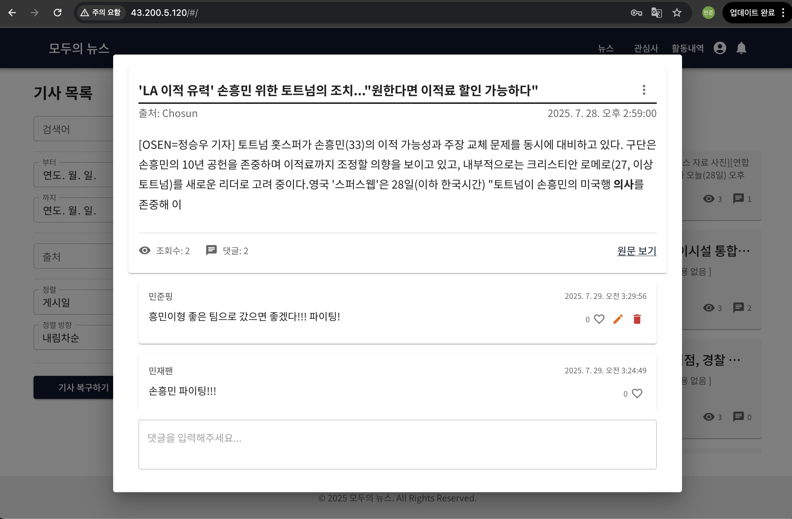
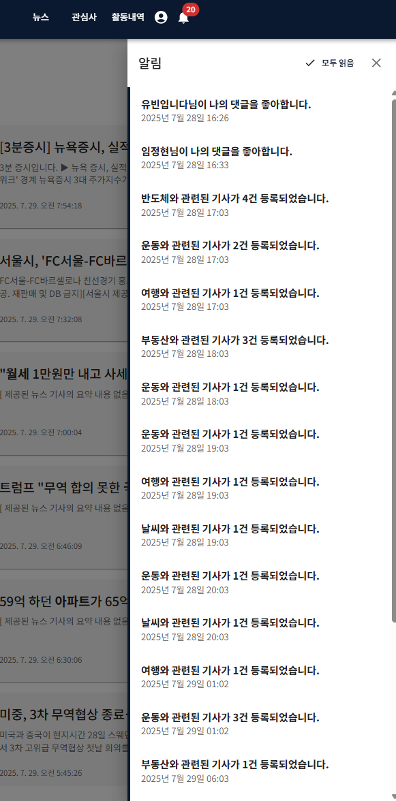
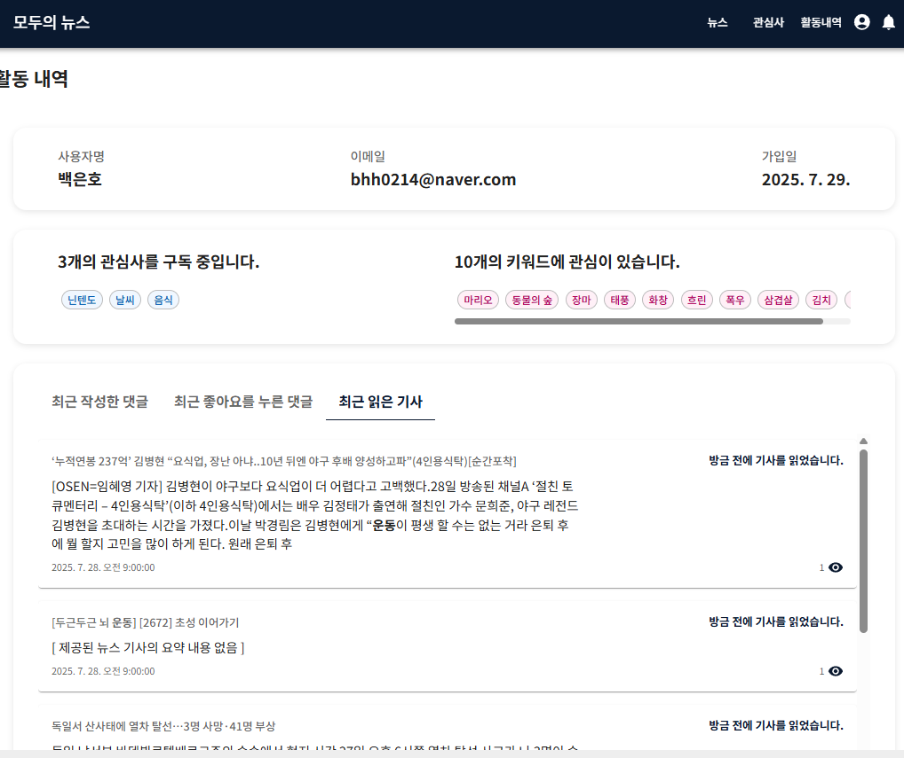
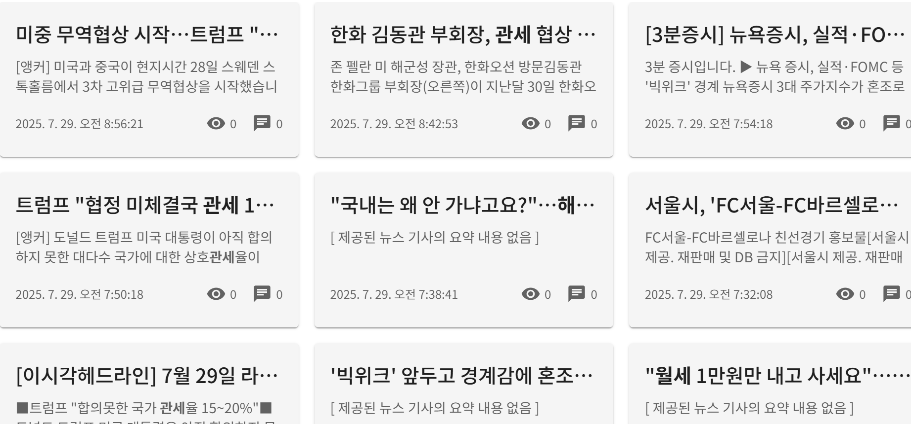
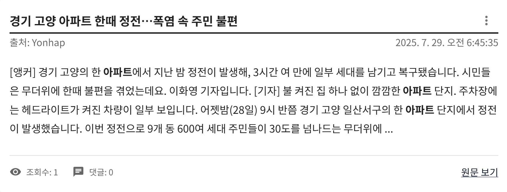
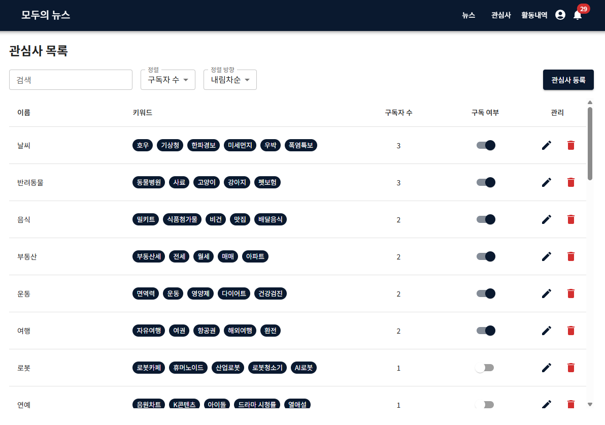
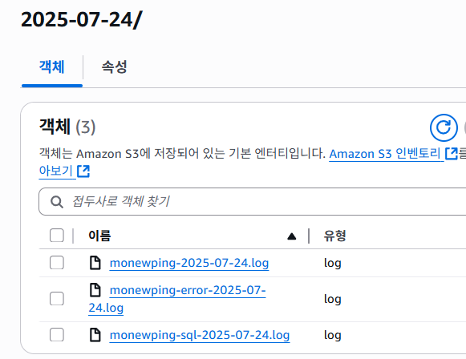

## **[ 모두의 뉴스 ]**

[](https://github.com/monewping/Heartsping/actions/workflows/ci.yml)
[](https://codecov.io/gh/monewping/Heartsping)
[](https://openjdk.java.net/projects/jdk/17/)
[](https://spring.io/projects/spring-boot)

<br/>

## **프로젝트 소개**
> 여러 뉴스 API를 하나로 모아 **사용자의 관심사에 맞는 뉴스를 구독**하고,  
> 뉴스에 대한 생각과 의견을 자유롭게 나눌 수 있는 **소셜 서비스**입니다. 📰💬

<br/>

**프로젝트 기간** <br/>
2025.07.09 ~ 2025.07.30

🔗[팀 노션 페이지 바로가기](https://www.notion.so/4-207649136c118047b997dcecb838e150?pvs=21)

<br/>

## **팀원 구성**

| 이름  | 역할                              | Github                                    |
|-----|-------------------------------------|-------------------------------------------|
| [김민준](#김민준) | 댓글 도메인 설계 및 구현                     | [adjoon1](https://github.com/adjoon1) |
| [김유빈](#김유빈) | 알림 도메인 설계 및 구현 · SpringBatch       | [Im-Ubin](https://github.com/Im-Ubin) |
| [백은호](#백은호) | 사용자 도메인 설계 및 구현 · MongoDB         | [BackEunHo](https://github.com/BackEunHo) |
| [이건민](#이건민) | 뉴스 기사 도메인 설계 및 구현 · AWS S3       | [GeonMin02](https://github.com/GeonMin02) |
| [임정현](#임정현) | 관심사 도메인 설계 및 구현 · AWS 배포        | [HuInDoL](https://github.com/HuInDoL) |


<br/>

## **기술 스택**

### Backend


### DB


### Deploy


### Test


### Collaboration


<br/>

## **팀원별 구현 기능 상세**

### 김민준


**댓글 관리**

- 댓글 목록 조회 기능
    - 기사 ID를 기준으로 댓글 목록을 조회하는 API 구현
    - 커서 기반 페이지네이션 적용
- 댓글 등록 기능
    - 사용자 ID 및 기사 ID를 기반으로 댓글 등록 API 구현
    - 등록 시 해당 기사 댓글 수 1 증가
- 댓글 삭제 기능
    - 논리 삭제: isDeleted = true로 처리, 내용은 마스킹 처리
    - 물리 삭제: DB에서 완전 삭제, 연관 좋아요도 제거
    - 삭제 시 기사 댓글 수 감소 처리
- 댓글 수정 기능
    - 댓글 작성자 본인만 수정 가능
    - 삭제된 댓글은 수정 불가 처리
- 댓글 좋아요 등록 및 취소 기능
    - 사용자 ID와 댓글 ID로 좋아요 관리
    - 중복 방지 및 likeCount 실시간 반영

<br/>

### 김유빈


**알림 관리**
- 알림 등록
  - 사용자가 구독한 관심사에 해당하는 새 기사가 등록되었을 경우, 혹은 사용자가 작성한 댓글에 좋아요가 등록되었을 때 알림 생성
- 알림 목록 조회
  - 등록된 알림 중에서 사용자가 확인하지 않은 상태의 알림만 목록 조회
  - 복합 커서 기반 안정적인 페이지네이션 구현
- 단일 알림 수정
  - 알림을 클릭 시, 해당 알림 읽음 처리
  - 읽음 처리된 알림은 목록에서 더 이상 조회되지 않음
- 전체 알림 수정
  - 모두 읽음 버튼을 클릭 시, 알림 목록에 있는 전체 알림 읽음 처리
- 알림 비활성화
  - 사용자가 알림을 확인하기 전, 해당 알림의 리소스가 먼저 논리/물리 삭제되었을 경우 알림 상태 비활성화
  - 알림 대상의 사용자 화면에서는 알림이 삭제되지 않음
- 알림 삭제
  - 매일 오전 5시에 배치 작업으로 알림이 확인된 지 1주일이 경과된 알림을 자동 삭체 처리

<br/>

### 백은호


**사용자 정보 관리**
- 회원 가입/로그인
  - 이메일, 닉네임, 비밀번호를 입력받아 새로운 계정을 생성하는 회원 가입을 구현했습니다.  
    이메일 중복 검증을 통해 동일한 이메일로 가입할 수 없도록 제한하고, Bean Validation을 활용해 데이터의 유효성을 검사했습니다.
  - 이메일과 비밀번호로 사용자 인증을 수행하고, 로그인 성공 시 사용자 활동 내역을 초기화하여 새로운 사용자의 활동을 추적할 수 있도록 하였습니다.
- 정보 수정
  - 사용자의 닉네임을 수정한을 있는 PATCH API를 구현했습니다.
    닉네임 변경 시 사용자 활동 내역에도 반영되게 하여 일관성을 유지했습니다.
		
**사용자 활동 내역 관리**
- 사용자 정보, 구독 중인 관심사, 작성한 댓글, 좋아요 누른 댓글, 조회한 뉴스 기사 정보를 가지는 사용자 활동 내역을 제공합니다.  
  작성 댓글, 좋아요 누른 댓글, 조회한 기사 내역들은 각각 최대 10건씩 최근 내역들로 유지됩니다.
- RDBMS로 사용자 활동 내역을 설계할 경우 많은 조인이 필요하게 되어 MongoDB를 활용한 역정규화 모델을 구성했습니다.  
- 사용자의 모든 활동이 실시간으로 활동 내역에 반영되도록 연동 시스템을 구축했습니다.  
  관심사 구독이나 구독 취소 시 구독 목록이 업데이트되고, 댓글 작성, 수정, 삭제 시 댓글 목록이 동기화됩니다.  
  댓글에 좋아요를 누르거나 취소할 때도 활동 내역이 즉시 반영되며, 뉴스 기사를 조회할 때마다 최근 본 기사 목록이 업데이트됩니다.  
  이를 통해 사용자는 언제든지 자신의 활동 내역을 정확하게 확인할 수 있습니다.

<br/>

### 이건민



**뉴스 기사 관리**
- 뉴스 기사 수집
  - 관심사 키워드를 제목 혹은 내용으로 가진 뉴스 기사를 매핑하며, 매핑에 사용된 키워드는 하이라이트 처리되어 DB에 저장됨
  - 인코딩 문자열을 디코딩 처리하여 수집되는 출처 링크의 문자열 길이를 줄임
- 뉴스 기사 조회
  - Naver Open API를 이용하여 외부 Rss_Feed_Url 3곳에서 수집 저장된 뉴스 기사를 불러와 확인할 수 있음
  - 제목, 요약, 발행일, 출처, 원본 기사 URL 등의 정보가 제공됨
  - 제공된 요약 내용이 없을 경우, 고정된 마스킹 문구로 대체됨
  - 한 번 읽은 뉴스 기사는 블러 처리되어, 이미 읽었다는 정보를 나타냄
- 뉴스 기사 백업 및 복구
  - AWS의 S3의 정보를 바인딩하여 연결하고, 매일 자정 수집된 뉴스 기사를 S3 저장소에 백업 데이터로 저장
  - 기간 지정 시, 해당 기간 내에 원본 출처 URL까지 삭제되어 유실된 뉴스 기사 데이터를 백업 데이터와 비교하여 복구함

<br/>

### **임정현**



**관심사 관리**
- 뉴스 기사 수집 기반이 되는 관심사와 그에 속한 키워드 CRUD 로직 구현
  - 관심사 등록 시 유사하거나 중복되는 이름 등록 불가
  - 관심사 이름은 수정 불가, 키워드만 수정 가능
  - 관심사 목록 조회는 구독자 수와 이름의 정렬 방식을 가지는 커서 페이지네이션
- 사용자는 자신이 선호하는 관심사를 구독하여 관련 뉴스 수집 시 알림 수신 가능

**로그 백업 기능 구현**
- 프로젝트 IAM을 만들어 AWS S3에 전날의 로그를 기본, ERROR, SQL 로그로 분리하여 매일 오전 2시마다 백업

---

<br/>

## **프로젝트 아키텍처**


## **파일 구조**

```

src/
├── main/
│   ├── java/
│   │   └── org/project/monewping/
│   │       ├── MonewpingApplication.java
│   │       ├── domain/
│   │       │   ├── article/
│   │       │   │   ├── config/
│   │       │   │   ├── controller/
│   │       │   │   ├── dto/
│   │       │   │   │   ├── data/
│   │       │   │   │   ├── request/
│   │       │   │   │   └── response/
│   │       │   │   ├── entity/
│   │       │   │   ├── exception/
│   │       │   │   ├── fetcher/
│   │       │   │   ├── mapper/
│   │       │   │   ├── repository/
│   │       │   │   ├── scheduler/
│   │       │   │   ├── service/
│   │       │   │   │   ├── impl/
│   │       │   │   └── storage/
│   │       │   ├── comment/
│   │       │   │   ├── controller/
│   │       │   │   ├── entity/
│   │       │   │   ├── dto/
│   │       │   │   ├── exception/
│   │       │   │   ├── mapper/
│   │       │   │   ├── repository/
│   │       │   │   └── service/
│   │       │   ├── interest/
│   │       │   │   ├── controller/
│   │       │   │   ├── dto/
│   │       │   │   │   ├── request/
│   │       │   │   │   └── response/
│   │       │   │   ├── entity/
│   │       │   │   ├── exception/
│   │       │   │   ├── mapper/
│   │       │   │   ├── repository/
│   │       │   │   │   ├── impl/
│   │       │   │   └── service/
│   │       │   │       ├── impl/
│   │       │   ├── notification/
│   │       │   │   ├── batch/
│   │       │   │   ├── controller/
│   │       │   │   ├── dto/
│   │       │   │   │   ├── request/
│   │       │   │   │   ├── response/
│   │       │   │   │   └── NotificationDto.java
│   │       │   │   ├── entity/
│   │       │   │   │   └── Notification.java
│   │       │   │   ├── exception/
│   │       │   │   ├── mapper/
│   │       │   │   ├── repository/
│   │       │   │   └── service/
│   │       │   ├── user/
│   │       │   │   ├── controller/
│   │       │   │   ├── entity/
│   │       │   │   ├── dto/
│   │       │   │   │   ├── request/
│   │       │   │   │   └── response/
│   │       │   │   ├── exception/
│   │       │   │   ├── mapper/
│   │       │   │   ├── repository/
│   │       │   │   └── service/
│   │       │   └── useractivity/
│   │       │       ├── controller/
│   │       │       ├── document/
│   │       │       ├── dto/
│   │       │       ├── exception/
│   │       │       ├── mapper/
│   │       │       ├── repository/
│   │       │       └── service/
│   │       └── global/
│   │           ├── base/
│   │           ├── config/
│   │           ├── dto/
│   │           ├── exception/
│   │           ├── scheduler/
│   │           └── service/
│   └── resources/
│       └── static/
│           └── assets/
└── test/
    ├── java/
    │   └── org/project/monewping/
    │       ├── domain/
    │       │   ├── article/
    │       │   │   ├── controller/
    │       │   │   ├── entity/
    │       │   │   ├── fetcher/
    │       │   │   ├── integration/
    │       │   │   ├── mapper/
    │       │   │   ├── repository/
    │       │   │   ├── scheduler/
    │       │   │   ├── service/
    │       │   │   └── storage/
    │       │   ├── comment/
    │       │   │   ├── controller/
    │       │   │   ├── repository/
    │       │   │   └── service/
    │       │   ├── interest/
    │       │   │   ├── controller/
    │       │   │   ├── entity/
    │       │   │   ├── integration/
    │       │   │   ├── repository/
    │       │   │   └── service/
    │       │   ├── notification/
    │       │   │   ├── controller/
    │       │   │   ├── entity/
    │       │   │   ├── integration/
    │       │   │   ├── repository/
    │       │   │   └── service/
    │       │   ├── user/
    │       │   │   ├── controller/
    │       │   │   ├── domain/
    │       │   │   ├── integration/
    │       │   │   ├── repository/
    │       │   │   └── service/
    │       │   └── useractivity/
    │       │       ├── controller/
    │       │       ├── integration/
    │       │       ├── mapper/
    │       │       ├── repository/
    │       │       └── service/
    │       └── global/
    │           └── exception/
    └── resources/

```

---


## **프로젝트 회고록**

[Heartsping.zip](attachment:9eb1ca8e-503b-40d8-965a-47a03bcae5ee:Heartsping.zip)

